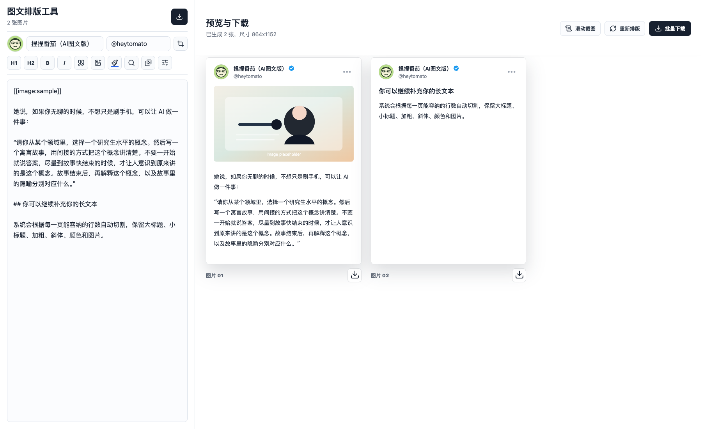

# 图文排版工具

一个用于生成小红书 / X 风格图文卡片的本地排版工具。输入一段长文本后，工具会自动分页排版，并支持导出所有图片；也可以切换到滑动截图模式，在单张长卡片中手动滑动截图。

## 预览

### 自动分页模式



### 滑动截图模式


## 功能特点

- 长文本自动切割分页，生成 864 x 1152 的图文卡片
- 支持滑动截图模式，单张卡片内手动滚动预览内容
- 支持大标题、小标题、加粗、斜体、引用和局部文字颜色
- 支持中文字体和英文字体分别选择
- 支持插入正文图片，并对正文图片和头像进行裁剪
- 支持修改头像、名称、英文昵称和认证标识
- 支持查找、替换当前、全文替换
- 支持单张下载和批量打包下载
- 支持 `Command + Z` 撤销和 `Command + Shift + Z` 重做编辑框操作

## 本地使用

这个项目是静态页面，可以直接打开 `index.html` 使用。

也可以启动本地服务：

```bash
npm start
```

然后访问：

```text
http://127.0.0.1:5173/
```

## 使用流程

1. 在左侧编辑框输入或粘贴长文本。
2. 使用顶部工具栏设置标题、加粗、斜体、引用、颜色和插图。
3. 在个人信息区域修改头像、名称和英文昵称。
4. 在设计设置中调整文字色、背景色、字号、行距、中文字体、英文字体和图片高度。
5. 右侧预览区会自动生成卡片。
6. 点击“批量下载”导出全部图片，或点击单张卡片的下载按钮导出当前图片。

## 文字上色

点击画笔按钮后：

1. 选择字体颜色。
2. 点击“确定”。
3. 在编辑框中选中需要上色的文字。

工具会自动给选中文字添加颜色标记，并刷新右侧预览。

## 图片裁剪

正文图片和头像都支持裁剪。裁剪时可以选择常用比例，也可以使用自由比例；如果不裁剪，工具会按照默认显示规则放入卡片。

## 项目结构

```text
.
├── index.html
├── package.json
├── src
│   ├── app.js
│   └── styles.css
└── outputs
```

## 技术说明

- 纯前端实现，无需后端服务
- 使用 Canvas 渲染最终图片
- 使用 JSZip 在浏览器内打包批量下载
- 使用本地存储保存编辑状态
