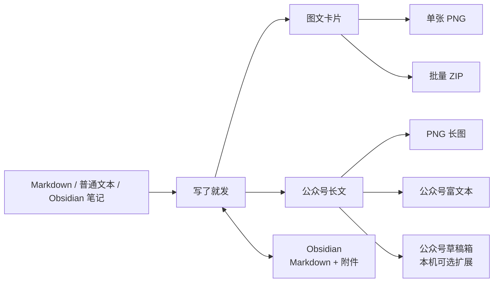

# 写了就发 · Write Then Publish

> 把同一份内容，在「图文卡片」与「公众号长文」之间自由切换。<br>
> 写完以后，少做几遍重复排版。

[在线体验：fawen.fun](https://fawen.fun) · [查看工作区](#两种工作区) · [本地运行](#本地运行) · [MIT License](LICENSE)


## 这是什么

**写了就发**是一个面向中文内容创作者的、本地优先的排版与发布准备工具。

你可以粘贴 Markdown、普通文本或 Obsidian 笔记，在同一个编辑器中完成：

- 自动拆分小红书 / X 风格图文卡片；
- 预览和整理公众号长文；
- 在图文卡片与长文之间一键切换；
- 导出单张 PNG、高清长图或批量 ZIP；
- 复制带样式的公众号富文本；
- 读取 Obsidian 图片，并把修改后的 Markdown 和附件同步回仓库；
- 在已配置的本机环境中，将文章创建或更新到公众号草稿箱。

它不负责替你写内容，重点解决的是**写完之后的最后一公里**：分版、排版、预览、图片处理、多格式复用与发布前确认。

## 为什么做这个项目

一篇内容从草稿走到发布，通常要经历多次重复劳动：

1. 在笔记软件里写完；
2. 为小红书重新拆成多张图；
3. 为公众号再排一次长文；
4. 调整图片尺寸、头像、字体和留白；
5. 分别下载、复制或重新上传；
6. 修改后又要回到原稿同步一遍。

写了就发把这些动作收进一个工作区：



同一份内容可以在不同输出之间切换，不必先决定“这篇到底发哪里”。

## 在线体验

直接打开：

**https://fawen.fun**

在线版不需要注册或安装，适合立即体验：

- 图文自动分页；
- 长文主题排版；
- 图片上传、裁剪与调整；
- 本地历史记录；
- PNG / ZIP 导出；
- 公众号富文本复制；
- Obsidian 文件夹连接与图片读取；
- 在浏览器支持并获得授权时，直接写回 Obsidian。

在线版不能访问你电脑的 macOS 钥匙串或本机公众号同步队列，因此**不会直接创建公众号草稿**。需要草稿箱同步时，请使用已经配置好相关环境的本地版。

## 核心工作流

### 1. 写入或导入内容

支持：

- 直接输入或粘贴普通文本；
- 粘贴 Markdown；
- 粘贴截图或剪贴板图片；
- 拖入图片文件；
- 一次上传多张正文图片；
- 连接 Obsidian 仓库后，解析 `![[图片.png]]`；
- 解析标准 Markdown 图片语法 ``。

### 2. 选择输出方式

#### 图文卡片

把长内容自动拆成多张竖版图片，适合：

- 小红书图文；
- X 长帖截图；
- 知识卡片；
- 图文教程；
- 长文拆条；
- 带图观点内容。

#### 长文

把同一份内容渲染成文章样式，适合：

- 公众号文章；
- Markdown 长文预览；
- 文章归档；
- 带主题样式的长图；
- 复制到公众号编辑器继续微调。

### 3. 调整版式

可以设置：

- 大标题、小标题、加粗、斜体和引用；
- 字体颜色与文字背景色；
- 中文字体与英文字体；
- 字号、行距和段落节奏；
- 卡片文字色、强调色和背景色；
- 头像、显示名称和昵称；
- 每页显示头像，或仅首页显示头像；
- 长文主题、字体、字号与主题色；
- 明暗界面主题。

编辑框中的空行会被保留，可用于主动控制图文节奏，而不是完全交给自动分页。

### 4. 处理图片

支持：

- 头像上传与裁剪；
- 正文图片上传、粘贴和拖放；
- 自由、原图、`1:1`、`4:3`、`16:9`、`3:4`、`9:16` 裁剪比例；
- 单图左对齐、居中和右对齐；
- 在预览区直接拖动缩放；
- 批量设置图片宽度百分比；
- 批量设置固定宽高，并按原比例居中裁切；
- 尽量保留图片原始比例与细节。

### 5. 导出或继续发布

- 图文卡片：下载单张 PNG；
- 图文卡片：批量打包为 ZIP；
- 滑动截图：下载当前长卡片画面；
- 长文：导出 PNG 长图；
- 长文：复制带内联样式的公众号富文本；
- Obsidian：写回 Markdown 与附件，或下载 Obsidian 导入包；
- 本机扩展：确认标题和封面后同步到公众号草稿箱。

## 两种工作区

### 图文卡片模式


系统会根据页面容量自动分页，并尽量保留：

- 标题层级；
- 加粗和斜体；
- 引用块；
- 字体颜色和背景色；
- 正文图片；
- 手动空行；
- 个人信息区域。

卡片逻辑尺寸为 `864 × 1152`，实际使用 2 倍 Canvas 渲染，导出尺寸为 `1728 × 2304` PNG。

### 仅首页显示头像


当内容页数较多时，可以只在第一页保留头像、名称和昵称，让后续页面获得更多正文空间。

### 长文模式


长文模式支持：

- Markdown 标题、段落、列表、引用、代码和表格；
- 正文图片；
- 经典、优雅、简洁、微信绿、多彩微信主题；
- 无衬线、衬线和等宽字体；
- 多档字号；
- 翡翠绿、经典蓝、活力橘、薰衣紫、石墨黑主题色；
- PNG 长图下载；
- 公众号富文本复制；
- 本机公众号草稿同步。

### 滑动截图模式


内容较长但希望保持单张卡片视觉时，可以在预览卡片内滚动并下载当前画面。

## 一份内容，多种输出

顶部转换按钮会根据当前工作区自动变化：

- 图文模式显示 `转长文`；
- 长文模式显示 `转图文`。

转换只改变排版输出方式，不重写正文。你可以在内容尚未完成时来回切换，也可以用同一份稿件分别制作社交媒体卡片和公众号版本。

## 能力矩阵

| 能力 | 在线版 `fawen.fun` | 直接打开 `index.html` | 本地服务 `npm start` |
|---|:---:|:---:|:---:|
| 图文卡片与自动分页 | ✅ | ✅ | ✅ |
| 长文排版与主题 | ✅ | ✅ | ✅ |
| 本地历史记录 | ✅ | ✅ | ✅ |
| PNG / ZIP 导出 | ✅ | ✅ | ✅ |
| 公众号富文本复制 | ✅ | ✅ | ✅ |
| Obsidian 图片读取 | ✅ | ✅ | ✅ |
| 直接写回 Obsidian | 取决于浏览器权限 | — | — |
| Obsidian ZIP 导入包 | ✅ | ✅ | ✅ |
| 公众号草稿箱同步 | — | — | 可选扩展 |

说明：

- “直接写回 Obsidian”目前只在在线版中尝试启用，并依赖浏览器的目录读写能力和用户授权；不可写时会改为下载 ZIP 导入包。
- “公众号草稿箱同步”不是通用的零配置能力，依赖本机额外环境，详见[公众号工作流](#公众号工作流)。
- 历史记录保存在当前浏览器的本地存储中，不会自动跨浏览器或跨设备同步。

## Obsidian 双向工作流

### 从 Obsidian 导入

1. 点击工具栏中的 Obsidian 按钮；
2. 选择并授权一个 Vault；
3. 从 Obsidian 复制 Markdown；
4. 粘贴到左侧编辑框；
5. 工具会在已授权目录中查找 Markdown 引用的本地图片。

支持的图片引用包括：

```md
![[图片.png]]
![[附件/图片.png]]

```

### 同步回 Obsidian

修改完成后点击 `同步回 Obsidian`：

- 支持目录写入时，内容会保存到 `写了就发/`；
- 新增图片会保存到 `写了就发/附件/`；
- 原本来自 Vault 的图片会尽量保留原引用；
- 浏览器只有读取权限时，会下载包含 Markdown 与附件的 ZIP 包，不会假装已经写入。

文件夹访问必须由用户主动授权。在线页面不会把 Vault 上传到项目服务器。

## 公众号工作流

### 复制公众号格式

长文模式中的 `复制公众号格式` 会：

1. 读取当前预览的实际样式；
2. 将必要样式转换为内联 CSS；
3. 同时写入富文本和纯文本剪贴板；
4. 供用户粘贴到公众号编辑器后继续检查。

这是在线版推荐的公众号工作流。

### 同步到草稿箱

本地版提供可选的 `同步草稿箱` 能力：

- 用户需要确认文章标题；
- 必须选择或确认封面；
- 正文中的本地图片会先被整理；
- 只创建或更新草稿；
- **不会直接发布文章**。

这项功能目前依赖仓库之外的本机环境：

- macOS 系统钥匙串中的公众号配置；
- `koubo-script-writer` 的草稿同步队列脚本；
- 对应的本机后台服务；
- 可用的公众号接口与网络配置。

因此，普通使用者只执行 `npm start` 并不会自动获得公众号草稿权限。当前仓库提供的是安全转发接口和前端确认流程，通用化的公众号凭据安装器尚未包含在本项目中。

## 历史记录与撤销

左侧历史栏会自动保存草稿，支持：

- 新建项目；
- 恢复历史内容；
- 删除记录；
- 按 `全部 / 图文 / 长文` 筛选；
- 显示项目类型；
- 内置只读说明项目。

编辑器支持：

- `Command + Z` 撤销；
- `Command + Shift + Z` 重做；
- 查找；
- 替换当前；
- 全文替换。

历史记录依赖浏览器 `localStorage`。清理站点数据、更换浏览器或使用隐私模式可能导致历史不可用，请及时导出重要内容。

## 本地运行

### 环境

核心前端没有构建步骤，也不需要安装前端依赖。

建议准备：

- 现代桌面浏览器；
- Python 3；
- 可选：Node.js / npm，仅用于执行快捷脚本；
- 网络连接，用于加载 JSZip、Lucide 和 html2canvas CDN 资源。

### 克隆

```bash
git clone https://github.com/fxyadela/write-then-publish.git
cd write-then-publish
```

### 方式一：直接打开

macOS 可以执行：

```bash
npm run open
```

也可以直接双击 `index.html`。

这种方式可以使用主要编辑与导出能力，但浏览器不会开放完整的本机服务接口。

### 方式二：启动本地服务

```bash
npm start
```

或：

```bash
python3 server.py
```

然后访问：

```text
http://127.0.0.1:5173/
```

服务只监听 `127.0.0.1`。公众号接口还会检查页面来源，只允许本机页面请求。

## 数据与安全边界

### 已确认的本地行为

- 草稿、项目历史和常用设置保存在浏览器本地存储；
- 卡片渲染和大部分导出在浏览器内完成；
- Obsidian 目录必须由用户主动选择和授权；
- 本地 Python 服务只绑定 `127.0.0.1:5173`；
- 公众号同步接口限制为本机来源；
- App Secret 不写入仓库，也不发送到浏览器；
- 本机公众号配置从 macOS 系统钥匙串读取；
- 草稿同步前必须明确确认标题和封面；
- 公众号动作只到草稿箱，不执行直接发布。

### 需要注意

- 页面通过 CDN 加载 JSZip、Lucide 和 html2canvas，因此不是完全离线应用；
- 浏览器本地存储不等于永久备份；
- 浏览器权限和剪贴板策略可能影响 Obsidian 直写、文件保存与富文本复制；
- 在线版不能访问本机钥匙串和公众号同步队列；
- 移动端已做响应式布局，但大量排版和图片编辑仍更适合桌面浏览器。

## 浏览器兼容性

核心编辑、预览与普通下载依赖标准浏览器 API。

以下能力可能因浏览器不同而降级：

- 目录读写；
- 原生文件保存选择器；
- 富文本剪贴板；
- 拖放文件；
- 大尺寸 Canvas 导出。

当目录写入不可用时，Obsidian 同步会下载 ZIP；当原生保存选择器不可用时，文件会交给浏览器默认下载机制。

## 技术实现

- **前端**：原生 HTML、CSS、JavaScript；
- **卡片渲染**：Canvas 2D；
- **长图导出**：html2canvas；
- **批量打包**：JSZip；
- **图标**：Lucide；
- **本地草稿中继**：Python 标准库 `ThreadingHTTPServer`；
- **历史与设置**：浏览器 localStorage；
- **Obsidian 目录访问**：File System Access API + 文件夹选择降级方案；
- **在线部署**：Vercel 静态站点。

项目没有前端构建步骤，`vercel.json` 直接把仓库根目录作为静态输出。

## 项目结构

```text
.
├── index.html                 # 页面结构与第三方资源入口
├── src/
│   ├── app.js                 # 编辑、分页、图片、导出和同步逻辑
│   └── styles.css             # 桌面与移动端界面样式
├── server.py                  # 本机静态服务与公众号草稿中继
├── package.json               # 本地快捷命令
├── vercel.json                # Vercel 静态部署配置
├── docs/
│   ├── screenshots/           # README 界面截图
│   └── xhs_ai_tech_radar/     # 项目内附的内容研究资料
├── README.md
└── LICENSE
```

## 部署

这是一个无构建步骤的静态前端项目，可直接导入 Vercel：

- Framework Preset：`Other`
- Build Command：留空
- Output Directory：`.`

`server.py` 仅用于本机能力，不应作为在线公开接口部署。在线站点应保持静态部署。

## 常见问题

### 为什么 Obsidian 没有直接写回，而是下载了 ZIP？

当前浏览器没有授予目录写入权限，或不支持所需的目录 API。ZIP 是明确的降级结果，并不代表写入失败后仍声称成功。

### 为什么在线版没有“同步公众号草稿箱”？

在线页面不能读取本机钥匙串和同步队列。在线版提供富文本复制；草稿箱同步只在已配置的本机服务中开放。

### 为什么 `npm start` 后仍不能同步公众号？

`npm start` 只启动本机页面和安全转发接口。还需要本机已有公众号 AppID、钥匙串密钥、`koubo-script-writer` 队列脚本及后台服务。

### 为什么本机配置完整，公众号状态仍显示不可用？

本机服务会分别检查“本地配置是否就绪”和“公众号接口是否真的可访问”。如果公众号后台的 IP 白名单未包含当前出口 IP，远程检查仍会失败；请先更新公众号后台的 IP 白名单，再重新检查。

### 为什么换浏览器后看不到历史记录？

历史记录存放在当前浏览器的本地存储中，不是云端账户数据。

### 为什么部分下载或长图功能无法使用？

请检查 JSZip 与 html2canvas 的 CDN 资源是否正常加载，并确认浏览器允许下载文件。

## 贡献

欢迎通过 Issues 或 Pull Requests 提交：

- 分页与排版问题；
- 浏览器兼容性修复；
- Markdown 支持改进；
- 图片处理优化；
- 新的长文主题；
- 更通用的发布渠道适配。

提交修复时，请说明：

1. 使用的浏览器和系统；
2. 原始内容或最小复现示例；
3. 预期排版；
4. 实际结果；
5. 如涉及导出，请附上预览截图。

## License

[MIT License](LICENSE) © 2026 捏捏番茄
