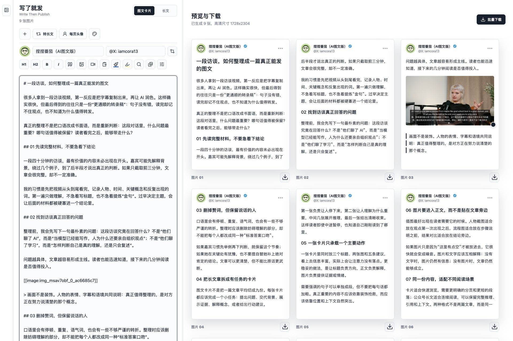
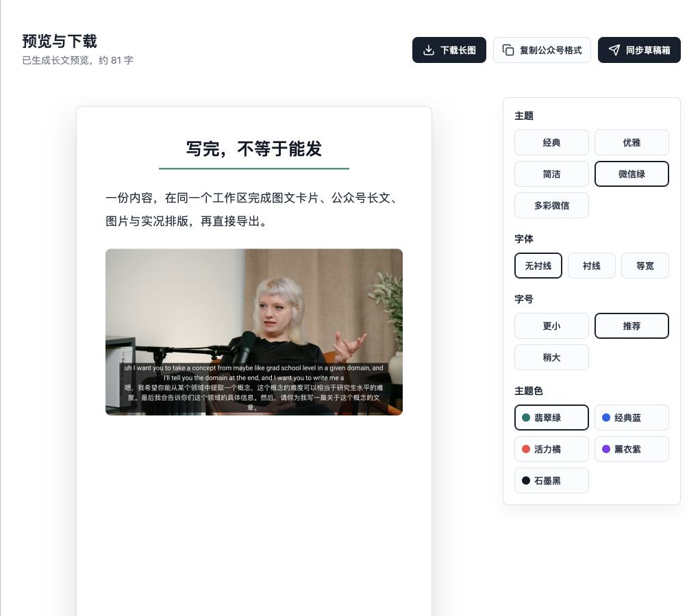
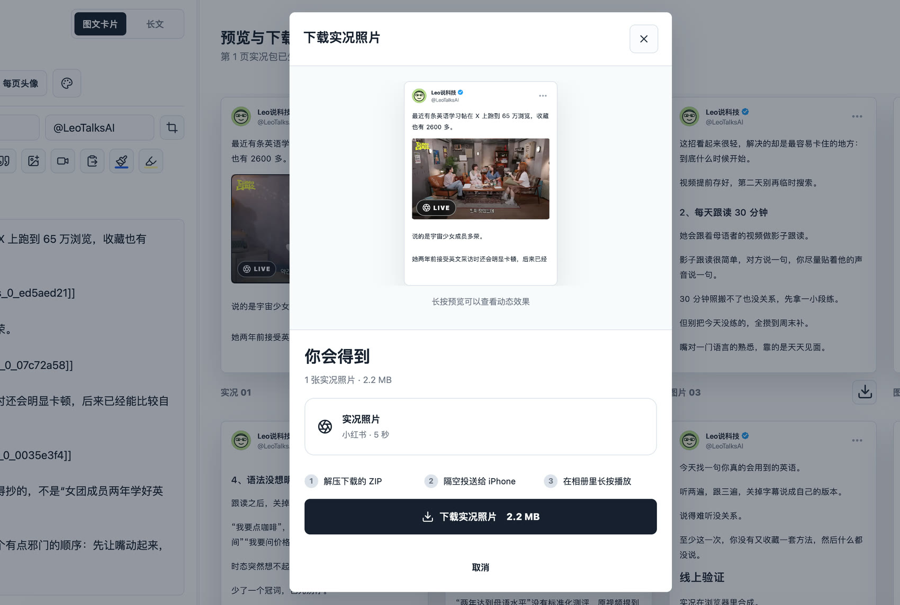
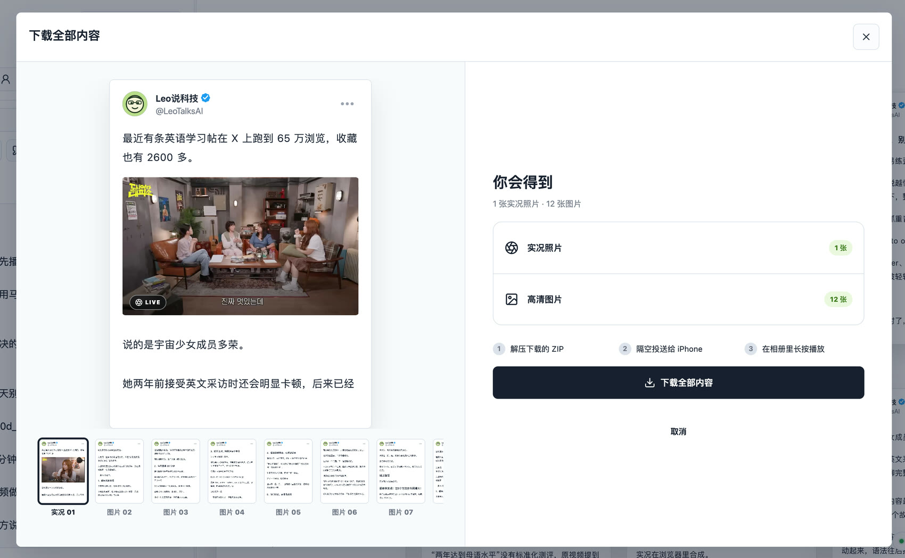
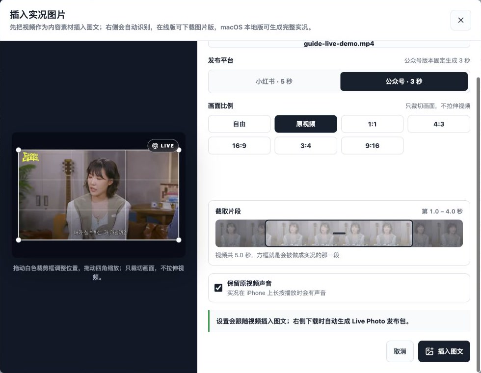

<div align="center">

# 写了就发 · Write Then Publish

### 写完，不必再到处排版。

一份内容，在同一个工作区完成图文卡片、公众号长文、图片与实况排版，再直接导出。

**[在线使用](https://fawen.fun)** · [核心功能](#核心功能) · [本地运行](#本地运行) · [能力矩阵](#能力矩阵)

[](LICENSE) [](#技术与边界) [](#live-photo) [](#账号与数据)

</div>

<p align="center">
  
</p>

**1920 × 1278 全屏实际页面**：左侧保留完整编辑框，右侧同时显示 9 张图文卡片；示例使用 1,853 字原创长文和真实图片，没有占位卡片。

## 把“写完之后”的最后一公里，收进一个页面

写了就发不替你写内容，专注解决分版、排版、素材处理、多格式复用和发布前确认。

### 同一份正文，两种输出

图文卡片自动分页，公众号长文保留 Markdown 结构。切换模式只改变输出形式，不会重写正文。

### 图片即传即排

支持上传、粘贴、拖放和批量导入；图片可以裁剪，并在预览区直接调整大小、位置和对齐。

### Obsidian 双向同步

读取 Wiki 图片引用；有目录权限时写回 Markdown 与附件，没有写入权限时明确降级为 ZIP。

## 同一份内容，真实切换为图文卡片与公众号长文

下面两张图均来自最新版实际运行页面。截图按完整宽度独立展示，避免并排压缩后看不清界面文字。

### 图文卡片

<p align="center">
  
</p>

**全屏多卡片工作区**

左侧显示完整编辑框，右侧三列并排展示 9 张卡片，前两排和包含真实图片的卡片同时可见。标准输出为 `1728 × 2304` PNG，默认正文 34 号。

图文卡片支持标题、引用、强调色、头像、普通图片和 Live Photo 混排；需要时可仅在首页显示头像，为后续页面留出更多正文空间。

### 公众号长文

<p align="center">
  
</p>

**全宽公众号长文**

长文保留标题、列表、引用、代码、表格和正文图片，支持主题、字体、字号与主题色设置。可以下载 PNG 长图、复制公众号富文本，或在配置完成的 macOS 本地版同步到公众号草稿箱。

## Live Photo

### 单张看细节，批量预览并一次下载整组内容

视频可以和头像、标题、正文一起排进图文卡片。插入时选择平台、画面比例、片段与声音；导出前可以检查单张效果，也可以按原始页序预览整组内容。

### 单张预览与下载

<p align="center">
  
</p>

**完整单张下载面板**

上方可长按预览动态效果；下方明确显示 `1 张实况照片`、文件大小、发布平台与时长、手机交接步骤和下载按钮。

### 批量预览与下载

<p align="center">
  
</p>

**完整批量下载面板**

左侧显示 Live Photo 当前页与整组缩略图；右侧明确列出 `1 张实况照片`、`12 张高清图片`、手机交接步骤和“下载全部内容”按钮。普通图片与实况页按原始顺序打包，不会打乱整组内容。

### 完整操作页面

<p align="center">
  
</p>

**平台、比例、片段与声音都在同一画面内**

- 小红书默认 5 秒，公众号默认 3 秒；
- 长视频会显示缩略图时间轴，可拖动选择片段；
- 支持画面裁剪、比例调整和原视频声音开关；
- 源视频短于目标时长时，片段时间轴自动隐藏。

### 真实 3 秒视频节选

<p align="center">
  <a href="docs/readme/live-photo-3s-preview.mp4">
    
  </a>
</p>

**[点击画面查看真实 3 秒 MP4 节选](docs/readme/live-photo-3s-preview.mp4)**。这不是示意动画，和截图中的人物、字幕及场景来自同一段实际视频。

### 生成与手机交接

支持 WebCodecs 的浏览器会在本地完成画面合成、封面帧、Apple 配对标记与打包。标准交接路径为：

```text
下载 ZIP → 解压 → 隔空投送整个 .pvt 到 iPhone → 在照片中长按确认动态效果
```

不要把 JPG 和 MOV 分开发送，否则可能丢失 Apple Live Photo 配对信息。

> “原视频不上传”只指浏览器本地生成这条路径。登录后的云端草稿同步会另行备份项目素材；不支持 WebCodecs 时，在线版还可能使用私有云端任务兜底。希望素材始终只留在当前设备时，请使用游客模式和受支持的浏览器。

## 核心功能

### 图片裁剪与拖动排版

- 上传、粘贴、拖放或批量导入图片；
- 支持自由、原图、`1:1`、`4:3`、`16:9`、`3:4`、`9:16`；
- 只裁切、不拉伸；
- 在右侧预览区直接拖动位置、调整对齐和大小；
- 图片保持高清重绘，不跟随文字画布降质。

### Obsidian 双向同步

- 读取 `![[图片.png]]`、`![[附件/图片.png]]` 和标准 Markdown 图片引用；
- 将 Markdown 保存到 `写了就发/`，新增图片保存到 `写了就发/附件/`；
- 浏览器无法写入目录时，明确降级为 Markdown + 附件 ZIP；
- Vault 必须由用户主动授权，在线页面不会把整个目录上传到项目服务器。

### 账号与数据

- **游客模式**：适合临时排版，数据只在当前标签页会话中保留；
- **登录模式**：使用 Supabase 按账号保存头像、昵称、草稿和项目素材；
- 登录状态有效时直接进入工作区，不强制每位用户注册；
- Row Level Security 按 `auth.uid()` 隔离数据。

自行部署账号功能时，运行 [`supabase/schema.sql`](supabase/schema.sql)，再填写 [`src/supabase-config.js`](src/supabase-config.js) 中的 Project URL 与 publishable key。

云端 Live Photo 兜底还需要应用 [`supabase/migrations/20260731_cloud_live_photo.sql`](supabase/migrations/20260731_cloud_live_photo.sql)、部署 `live-photo-jobs` Edge Function，并配置仓库专用 GitHub 触发凭证。不要把 `service_role` 或触发凭证写进前端和仓库。

### 公众号

- 在线版：复制带内联样式的公众号富文本；
- macOS 本地版：可选同步到公众号草稿箱；
- 同步只创建或更新草稿，不会直接群发；
- App Secret 从 macOS 钥匙串读取，不写入浏览器或仓库。

## 使用流程

1. **粘贴或导入**：输入 Markdown、普通文本，或连接 Obsidian；
2. **选择排版**：图文卡片或公众号长文；
3. **插入素材**：普通图片、视频或 Live Photo；
4. **预览与导出**：检查单页、整组和下载内容；
5. **传到手机发布**：下载图片、ZIP 或完整 `.pvt`。

## 能力矩阵

| 能力 | 在线版 | 直接打开 `index.html` | macOS 本地版 |
|---|:---:|:---:|:---:|
| 图文卡片、长文与图片裁剪 | ✅ | ✅ | ✅ |
| 单张 PNG、批量 ZIP、长图 | ✅ | ✅ | ✅ |
| Live Photo 卡片预览 | ✅ | ✅ | ✅ |
| 完整 `.pvt` 下载包 | ✅ 浏览器本地生成 | ✅ 浏览器本地生成 | ✅ 浏览器本地生成 |
| 片段选择、声音开关 | ✅ | ✅ | ✅ |
| 不支持 WebCodecs 时的兜底 | ✅ 云端生成 | — | ✅ 本机生成 |
| Finder 中显示、系统隔空投送 | — | — | 本机生成时可用 |
| Obsidian 图片读取与 ZIP 降级 | ✅ | ✅ | ✅ |
| Obsidian 直接写回 | 视浏览器权限 | 通常不可用 | 视浏览器权限 |
| Supabase 账号同步 | ✅ | 配置后可用 | 配置后可用 |
| 公众号富文本复制 | ✅ | ✅ | ✅ |
| 公众号草稿箱同步 | — | — | 可选 |

## 本地运行

### macOS 快速启动

双击：

```text
启动写了就发.command
```

或使用命令行：

```bash
git clone https://github.com/fxyadela/write-then-publish.git
cd write-then-publish
npm start
```

打开 `http://127.0.0.1:5173/`，并保留终端窗口。

只需要基础编辑与图片导出时，也可以直接打开 `index.html`。浏览器支持 WebCodecs 时，Live Photo 可在页面内本地生成；不支持时，本地服务的兜底路径需要 macOS、Python 3、`ffmpeg`、`ffprobe` 和 `uvx`。

## 技术与边界

**技术栈**：原生 HTML / CSS / JavaScript、Canvas 2D、WebCodecs、mp4box.js、mp4-muxer、html2canvas、JSZip、Supabase、GitHub Actions macOS、Python、FFmpeg、makelive 与 Vercel。

**明确边界**：

- 浏览器本地生成 Live Photo 时，原视频不出设备；云端兜底会通过私有签名上传，任务结束后清理源文件，下载链接会失效；
- 登录后的云端草稿同步会另行备份项目素材，这与 Live Photo 的本地生成是两条独立链路；
- 画面要叠进卡片，因此 H.264 需要重新编码；音轨在兼容时原样搬运；
- 平台是否保留 Live Photo 效果，取决于目标 App 当前使用的上传入口与规则；
- 游客历史和浏览器存储都不等于永久备份；
- `server.py` 只用于可信任的本机环境，不应直接暴露为公网 API；
- 页面仍通过 CDN 加载部分前端依赖，因此不是完全离线应用。

## 常见问题

<details>
<summary><strong>生成后怎么传到 iPhone？</strong></summary>

下载 ZIP，解压后在 Mac Finder 中选中整个 `.pvt`，通过系统共享菜单隔空投送到 iPhone。到照片里长按确认动态效果后，再进入目标平台发布。

</details>

<details>
<summary><strong>为什么不能把 JPG 和 MOV 分开发送？</strong></summary>

Apple 需要依靠配对标记识别完整 Live Photo。分开发送可能丢失配对信息，因此应传输整个 `.pvt`。

</details>

<details>
<summary><strong>为什么 Obsidian 下载了 ZIP？</strong></summary>

当前浏览器没有目录写入权限，或不支持相关 API。ZIP 是明确的降级结果，不代表内容已经写入 Vault。

</details>

<details>
<summary><strong>游客模式会永久保存吗？</strong></summary>

不会。游客模式适合临时排版；需要跨设备或长期保存时，请登录账号，或主动导出 Markdown、图片与附件。

</details>

## 贡献与许可

欢迎通过 Issues 或 Pull Requests 提交最小复现、预期结果、实际结果和相关截图。

[MIT License](LICENSE) © 2026 捏捏番茄
