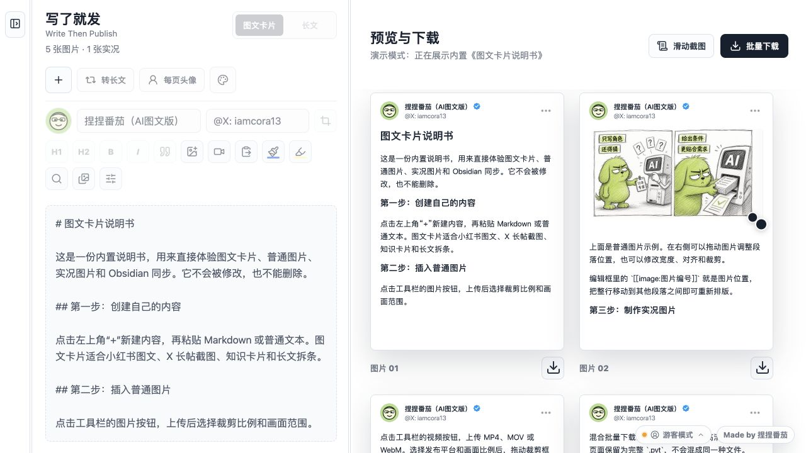
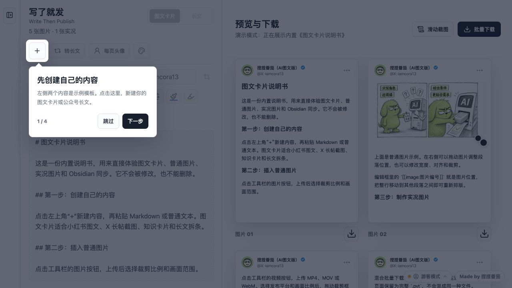
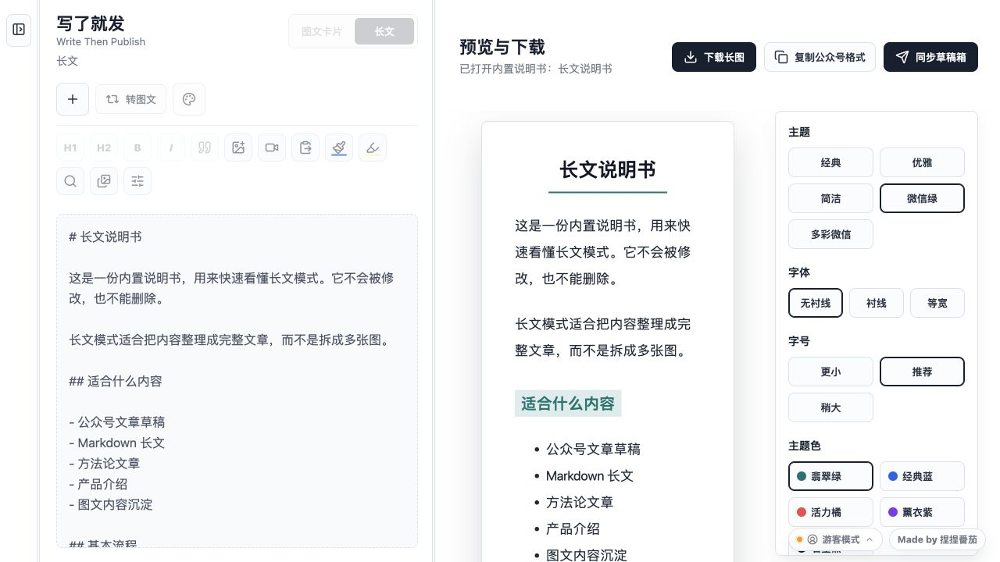
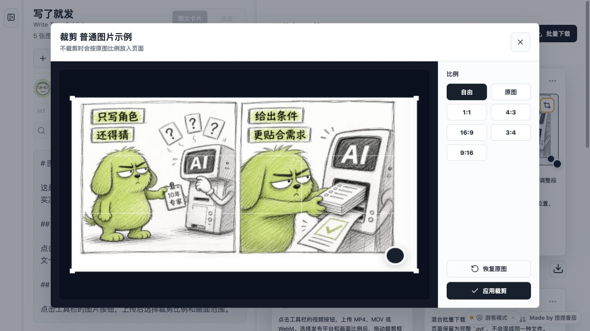
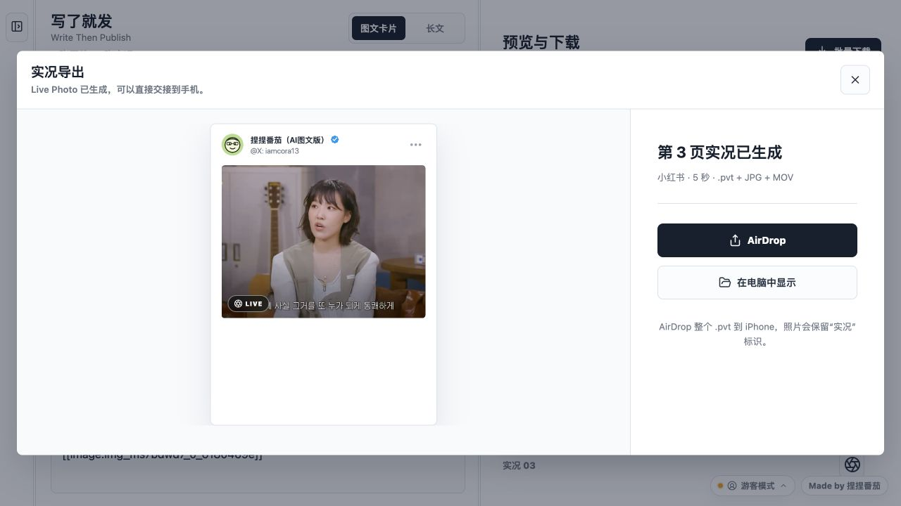
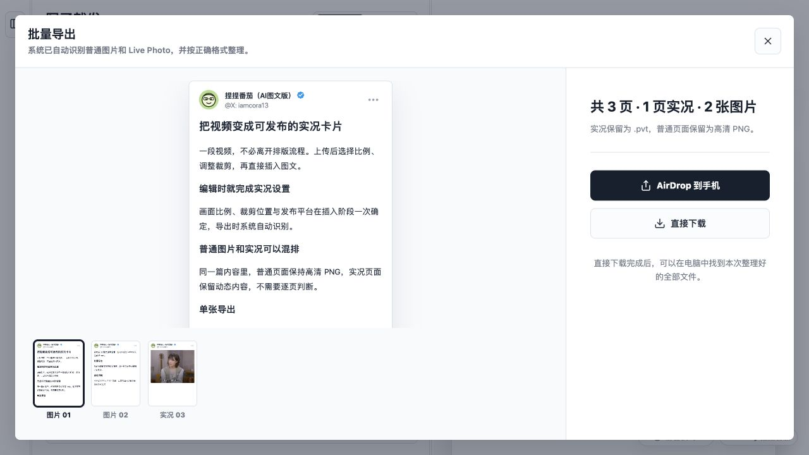
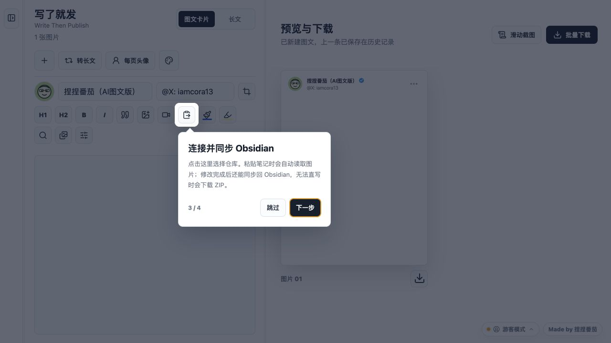
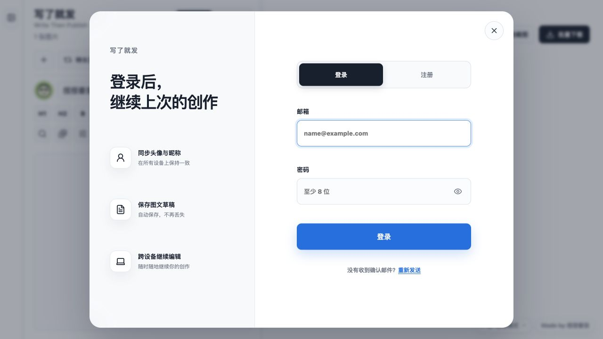

# 写了就发 · Write Then Publish

> 一份内容，排成图文卡片或公众号长文；图片、实况、Obsidian 与导出都在同一个工作区完成。

[](LICENSE)
[](#技术与边界)
[](https://fawen.fun)
[](#账号与数据)

**[在线使用](https://fawen.fun)** · [核心功能](#核心功能) · [本地运行](#本地运行) · [能力矩阵](#能力矩阵)



## 它解决什么

写完内容后，不必在多个工具之间重复排版：

- Markdown 自动分页为高清图文卡片；
- 同一份正文一键切换为公众号长文；
- 普通图片和视频实况直接嵌入内容；
- 在预览区拖动图片，所见即所得地调整位置；
- 导出单张、批量、长图或 Live Photo 发布包；
- 与 Obsidian 双向同步；
- 游客临时使用，或登录后跨设备保存草稿和作者资料。

适合小红书图文、X 长帖截图、知识卡片、图文教程和公众号文章。

## 使用流程

1. 新建内容，粘贴 Markdown 或普通文本；
2. 选择「图文卡片」或「长文」；
3. 插入图片、视频，或连接 Obsidian；
4. 在右侧预览并导出。



内置《图文卡片说明书》和《长文说明书》可直接体验，但始终只读，下载按钮也会置灰，避免误导出示例内容。

## 两种排版模式

<table>
  <tr>
    <td width="50%">
      
      <br><strong>图文卡片</strong><br>
      自动分页，支持标题、引用、强调色、头像和图片混排。标准输出为 1728 × 2304 PNG，默认正文 34 号。
    </td>
    <td width="50%">
      
      <br><strong>长文</strong><br>
      保留标题、列表、引用、代码、表格和图片，可下载长图、复制公众号富文本，或在本地版同步草稿箱。
    </td>
  </tr>
</table>

`转长文 / 转图文` 只改变排版输出，不会重写正文。

## 核心功能

### 图片裁剪与拖动排版



- 上传、粘贴、拖放或批量导入图片；
- 支持自由、原图、`1:1`、`4:3`、`16:9`、`3:4`、`9:16`；
- 只裁切、不拉伸；
- 在右侧预览区直接拖动位置、调整对齐和大小；
- 图片保持高清重绘，不跟随文字画布降质。

### Live Photo

视频不是独立播放器，而是和头像、标题、正文一起排进卡片。


制作流程：

```text
上传 MP4 / MOV / WebM
→ 选择平台时长和画面比例
→ 拖动裁剪框
→ 插入图文
→ 导出时自动识别
```

单页稳定支持一段实况素材。切到长文时继续静音循环预览；复制富文本或导出静态长图时使用封面帧。

#### 真实单张与批量导出

<table>
  <tr>
    <td width="50%">
      
      <br><strong>单张实况</strong><br>
      macOS 本地版可直接 AirDrop，或在 Finder 中显示完整发布包。
    </td>
    <td width="50%">
      
      <br><strong>混合批量</strong><br>
      自动区分普通 PNG 与实况页，并保持原始页序。
    </td>
  </tr>
</table>

两张截图均由真实视频生成，不使用彩条或占位素材。导出过程中会显示居中进度弹窗、具体百分比、完成页数和耗时。

> 在线版可预览、裁剪、排版并下载普通图片版；完整 `.pvt + JPG + MOV`、Finder 与 AirDrop 需要 macOS 本地服务。

可靠的手机交接方式：

```text
生成整张卡片 → AirDrop 整个 .pvt → iPhone 照片确认“实况” → 从目标 App 发布
```

不要把 JPG 和 MOV 分开发送，否则可能丢失 Apple Live Photo 配对信息。

### Obsidian 双向同步



- 读取 `![[图片.png]]`、`![[附件/图片.png]]` 和标准 Markdown 图片引用；
- 将 Markdown 保存到 `写了就发/`，新增图片保存到 `写了就发/附件/`；
- 浏览器无法写入目录时，明确降级为 Markdown + 附件 ZIP；
- Vault 必须由用户主动授权，在线页面不会把整个目录上传到项目服务器。

### 账号与数据



- **游客模式**：适合临时排版，数据只在当前标签页会话中保留；
- **登录模式**：使用 Supabase 按账号保存头像、昵称、草稿和项目素材；
- 登录状态有效时直接进入工作区，不强制每位用户注册；
- Row Level Security 按 `auth.uid()` 隔离数据。

自行部署账号功能时，运行 [`supabase/schema.sql`](supabase/schema.sql)，再填写 [`src/supabase-config.js`](src/supabase-config.js) 中的 Project URL 与 publishable key。不要把 `service_role` 写进前端或仓库。

### 公众号

- 在线版：复制带内联样式的公众号富文本；
- macOS 本地版：可选同步到公众号草稿箱；
- 同步只创建或更新草稿，不会直接群发；
- App Secret 从 macOS 钥匙串读取，不写入浏览器或仓库。

## 能力矩阵

| 能力 | 在线版 | 直接打开 `index.html` | macOS 本地版 |
|---|:---:|:---:|:---:|
| 图文卡片、长文与图片裁剪 | ✅ | ✅ | ✅ |
| 单张 PNG、批量 ZIP、长图 | ✅ | ✅ | ✅ |
| Live Photo 卡片预览 | ✅ | ✅ | ✅ |
| 完整 `.pvt`、Finder、AirDrop | — | — | ✅ |
| Obsidian 图片读取与 ZIP 降级 | ✅ | ✅ | ✅ |
| Obsidian 直接写回 | 视浏览器权限 | 通常不可用 | 视浏览器权限 |
| Supabase 账号同步 | ✅ | 配置后可用 | 配置后可用 |
| 公众号富文本复制 | ✅ | ✅ | ✅ |
| 公众号草稿箱同步 | — | — | 可选 |

## 本地运行

### macOS 快速启动

双击：

```text
启动写了就发.command
```

或使用命令行：

```bash
git clone https://github.com/fxyadela/write-then-publish.git
cd write-then-publish
npm start
```

打开 `http://127.0.0.1:5173/`，并保留终端窗口。

完整 Live Photo 需要 macOS、Python 3、`ffmpeg`、`ffprobe` 和 `uvx`。首次生成时，`uvx` 会准备 MIT 许可的 [`makelive`](https://github.com/RhetTbull/makelive) 0.7.0。

只需要基础编辑与图片导出时，也可以直接打开 `index.html`；此方式不包含本机 Live Photo 和公众号中继能力。

## 技术与边界

**技术栈**：原生 HTML / CSS / JavaScript、Canvas 2D、html2canvas、JSZip、Supabase、File System Access API、Python、FFmpeg、makelive、Vercel。

**明确边界**：

- 在线版不会伪装成已经生成 Live Photo；
- H.264 MOV 需要重新编码，项目采用高质量参数尽量减少可见损失；
- 平台是否保留实况效果，取决于目标 App 的上传入口与当前规则；
- 游客历史和浏览器存储都不等于永久备份；
- `server.py` 只用于可信任的本机环境，不应直接暴露为公网 API；
- 页面仍通过 CDN 加载部分前端依赖，因此不是完全离线应用。

## 常见问题

<details>
<summary><strong>为什么在线版不能 AirDrop Live Photo？</strong></summary>

在线静态站点不能调用 macOS 的 FFmpeg、Finder 与 AirDrop。请在 macOS 本地版生成完整 `.pvt`。
</details>

<details>
<summary><strong>为什么 Obsidian 下载了 ZIP？</strong></summary>

当前浏览器没有目录写入权限，或不支持相关 API。ZIP 是明确的降级结果，不代表已经写入 Vault。
</details>

<details>
<summary><strong>为什么收不到注册确认邮件？</strong></summary>

检查 Auth Redirect URL、垃圾邮件与发送日志。正式服务建议配置自有 SMTP，避免 Supabase 默认邮件服务的低额度限制。
</details>

## 贡献与许可

欢迎通过 Issues 或 Pull Requests 提交最小复现、预期结果、实际结果和相关截图。

[MIT License](LICENSE) © 2026 捏捏番茄
